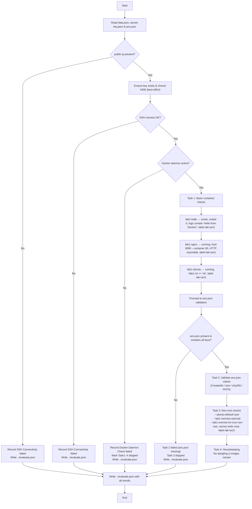

# MTP_CloudComputingLabs
This repo wil be used to maintain all the works related to CS797 MTP on Cloud Computing labs

```mermaid
graph TD
    A["Start"] --> B["Read data.json, secret-key.pem & ans.json"]
    B --> C{"public-ip present?"}

    C -->|No| F1["Record SSH Connectivity failed<br/>Write ../evaluate.json"]
    C -->|Yes| D["Ensure key exists & chmod 0400 (best-effort)"]

    D --> E{"SSH connect OK?"}
    E -->|No| F2["Record SSH Connectivity failed<br/>Write ../evaluate.json"]
    E -->|Yes| G{"Docker daemon active?"}

    G -->|No| H1["Record Docker Daemon Check failed<br/>Mark Task1–4 skipped<br/>Write ../evaluate.json"]
    G -->|Yes| T1["Task 1: Basic container checks"]

    %% ----- Task 1 -----
    T1 --> T1A["lab1-hello → exists, exited 0, logs contain 'Hello from Docker!', label lab=act1"]
    T1A --> T1B["lab1-nginx → running, host 8080→container 80, HTTP reachable, label lab=act1"]
    T1B --> T1C["lab1-ubuntu → running, /lab1.txt == 'ok', label lab=act1"]
    T1C --> AfterT1["Proceed to ans.json validation"]

    %% ----- Task 2 -----
    AfterT1 --> ReadAns{"ans.json present & contains all keys?"}
    ReadAns -->|No| F3["Task 2 failed (ans.json missing)\nTask 3 skipped\nWrite ../evaluate.json"]
    ReadAns -->|Yes| T2["Task 2: Validate ans.json values\n(CreatedAt / size / sha256 / PATH)"]

    %% ----- Task 3 -----
    T2 --> T3["Task 3: Non-root checks\n– ubuntu-default-user\n– lab1-nonroot-user/uid\n– lab1-nonroot-int runs non-root, cannot write /root, label lab=act1"]

    %% ----- Task 4 -----
    T3 --> T4["Task 4: Housekeeping\nNo dangling (<none>) images remain"]

    %% ----- Completion -----
    T4 --> S["Write ../evaluate.json with all results"]
    F1 --> S
    F2 --> S
    H1 --> S
    F3 --> S
    S --> Z["End"]

```
